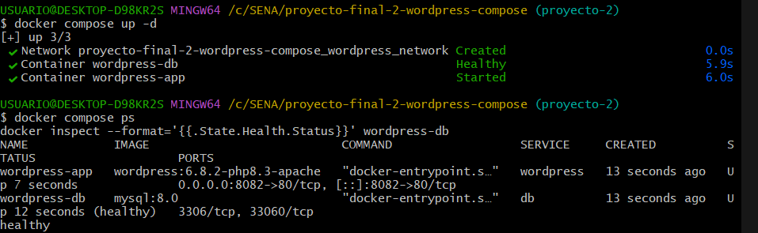
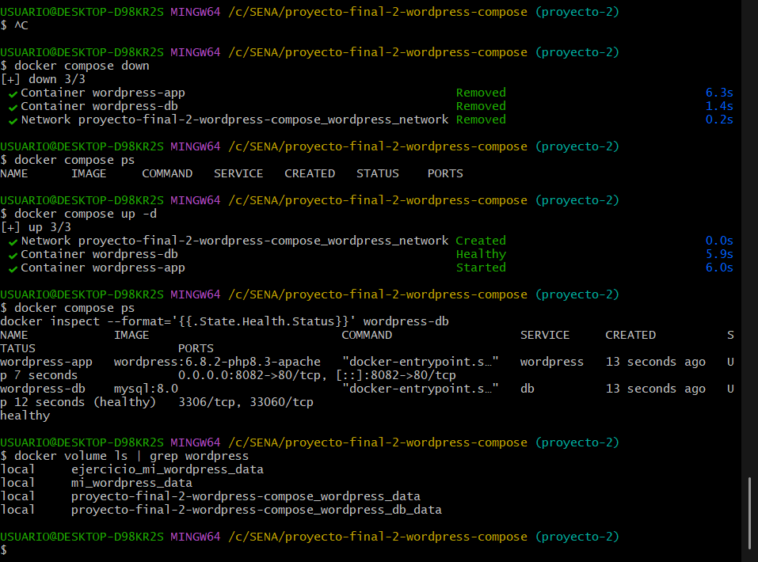
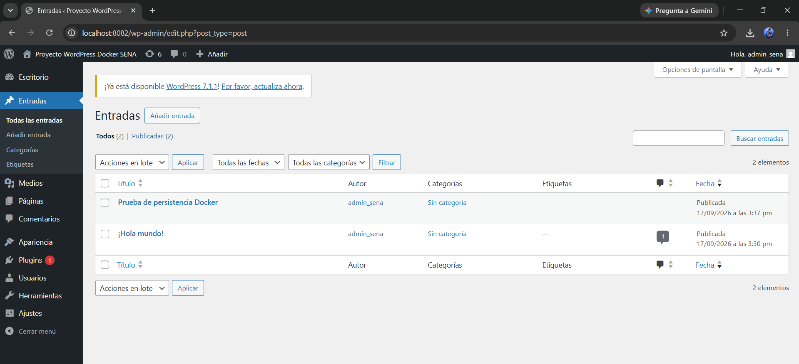

# Proyecto 2 — WordPress Persistente con Docker Compose

## 1. Descripción

Este proyecto despliega WordPress y MySQL 8 mediante Docker Compose. Cada componente se ejecuta en un contenedor independiente: WordPress funciona como aplicación web y MySQL almacena la configuración y la información del sitio.

El proyecto utiliza volúmenes nombrados de Docker para conservar tanto los datos de MySQL como los archivos de WordPress. Gracias a estos volúmenes, la información permanece disponible aunque los contenedores sean eliminados y creados nuevamente.

## 2. Objetivos

- Orquestar varios servicios mediante Docker Compose.
- Ejecutar WordPress y MySQL en contenedores separados.
- Utilizar variables de entorno para configurar los servicios.
- Mantener las credenciales locales fuera del repositorio.
- Crear una red personalizada para la comunicación interna.
- Utilizar volúmenes para conservar los datos.
- Configurar un healthcheck para MySQL.
- Utilizar `depends_on` con la condición `service_healthy`.
- Comprobar la persistencia después de recrear los contenedores.

## 3. Tecnologías utilizadas

- Docker
- Docker Compose
- WordPress
- MySQL 8
- Git
- GitHub

## 4. Arquitectura del proyecto

```text
wordpress-app
      ↓
wordpress_network
      ↓
wordpress-db
```

WordPress se conecta con MySQL utilizando `db`, que es el nombre del servicio definido en Docker Compose. Ambos servicios pertenecen a `wordpress_network`.

MySQL no publica el puerto 3306 hacia Windows porque solamente necesita comunicación interna con WordPress. La aplicación web se publica mediante el puerto definido en la variable `WORDPRESS_PORT`.

## 5. Estructura del proyecto

```text
proyecto-final-2-wordpress-compose/
├── evidencias/
│   ├── 01-contenedores-healthcheck.png
│   ├── 02-persistencia-contenedores-volumenes.png
│   └── 03-entrada-wordpress-persistente.png
├── .env.example
├── .gitignore
├── docker-compose.yml
└── README.md
```

- `evidencias/`: contiene las capturas que demuestran el funcionamiento y la persistencia.
- `.env.example`: presenta las variables necesarias sin incluir credenciales reales.
- `.gitignore`: evita que el archivo `.env` sea agregado al repositorio.
- `docker-compose.yml`: configura los servicios, volúmenes, red y healthcheck.
- `README.md`: documenta la instalación, ejecución y validación del proyecto.

El archivo `.env` existe únicamente en el entorno local y no aparece en el repositorio porque está ignorado por Git.

## 6. Requisitos

- Docker Desktop
- Docker Compose
- Git
- Navegador web

## 7. Clonar el repositorio

```bash
git clone https://github.com/JuanEstebanLT/proyecto-final-2-wordpress-compose.git
cd proyecto-final-2-wordpress-compose
```

## 8. Configuración de variables de entorno

Después de clonar el repositorio, se debe copiar el archivo de ejemplo para crear la configuración local. En Git Bash se utiliza:

```bash
cp .env.example .env
```

Luego se reemplazan los valores de ejemplo del nuevo archivo `.env` por valores locales. Las variables disponibles son:

```text
MYSQL_DATABASE
MYSQL_USER
MYSQL_PASSWORD
MYSQL_ROOT_PASSWORD
WORDPRESS_PORT
```

- `MYSQL_DATABASE`: nombre de la base de datos utilizada por WordPress.
- `MYSQL_USER`: usuario normal empleado para la conexión con MySQL.
- `MYSQL_PASSWORD`: contraseña local del usuario de MySQL.
- `MYSQL_ROOT_PASSWORD`: contraseña local del usuario administrador de MySQL.
- `WORDPRESS_PORT`: puerto del equipo anfitrión donde se publica WordPress.

El archivo `.env` debe conservarse solamente en el equipo local.

## 9. Archivo .gitignore

El archivo `.gitignore` excluye `.env` para evitar que las credenciales locales se publiquen en Git o GitHub. El repositorio incluye `.env.example` como guía segura, pero nunca debe incluir el contenido real de `.env`.

## 10. Servicios Docker Compose

| Servicio | Contenedor | Imagen | Función |
|---|---|---|---|
| `db` | `wordpress-db` | `mysql:8.0` | Base de datos |
| `wordpress` | `wordpress-app` | `wordpress:6.8.2-php8.3-apache` | Aplicación web |

## 11. Volúmenes persistentes

El proyecto utiliza dos volúmenes nombrados:

### `wordpress_db_data`

- Se monta en `/var/lib/mysql`.
- Conserva las bases de datos y demás información administrada por MySQL.

### `wordpress_data`

- Se monta en `/var/www/html`.
- Conserva los archivos instalados y generados por WordPress.

Al eliminar los contenedores y la red del proyecto, estos volúmenes se mantienen mientras no se solicite también su eliminación.

## 12. Red personalizada

Los servicios se conectan a la red:

```text
wordpress_network
```

Esta red utiliza el driver `bridge` y permite la comunicación interna entre WordPress y MySQL sin publicar el puerto 3306 en el equipo anfitrión.

## 13. Healthcheck de MySQL

El servicio `db` utiliza `mysqladmin ping` para comprobar periódicamente si MySQL ya está disponible.

- `interval`: define cuánto tiempo espera Docker entre cada comprobación.
- `timeout`: indica el tiempo máximo permitido para que responda cada comprobación.
- `retries`: establece cuántos intentos fallidos se permiten antes de marcar el servicio como no saludable.
- `start_period`: concede un tiempo inicial para que MySQL termine de iniciar antes de contar los fallos.

En este proyecto se comprueba el estado cada 10 segundos, con un tiempo máximo de 5 segundos, 5 intentos y un periodo inicial de 20 segundos.

## 14. depends_on

WordPress tiene configurada la siguiente dependencia:

```yaml
depends_on:
  db:
    condition: service_healthy
```

Esta condición hace que WordPress espere hasta que el healthcheck indique que MySQL está saludable antes de iniciar.

## 15. Validar la configuración

Para comprobar la validez del archivo Docker Compose sin iniciar los servicios:

```bash
docker compose config --quiet
```

Un código de salida `0` indica que la configuración es válida.

Para listar los servicios reconocidos:

```bash
docker compose config --services
```

El resultado esperado es:

```text
db
wordpress
```

## 16. Iniciar el proyecto

```bash
docker compose up -d
```

La opción `-d` ejecuta los servicios en segundo plano. Después se puede consultar su estado con:

```bash
docker compose ps
```

El contenedor `wordpress-db` debe aparecer con estado `healthy` cuando MySQL esté listo.

## 17. Acceso a WordPress

Con el valor local establecido para este proyecto, WordPress está disponible en:

```text
http://localhost:8082
```

El puerto puede variar si se modifica `WORDPRESS_PORT` en el archivo `.env` local.

## 18. Logs

Para consultar las últimas líneas generadas por MySQL:

```bash
docker compose logs db --tail=20
```

Para consultar las últimas líneas generadas por WordPress:

```bash
docker compose logs wordpress --tail=20
```

Estos comandos ayudan a revisar el inicio de los servicios y a identificar posibles errores de funcionamiento.

## 19. Verificación del healthcheck

El estado del healthcheck de MySQL se consulta con:

```bash
docker inspect --format='{{.State.Health.Status}}' wordpress-db
```

Cuando MySQL está disponible, el resultado esperado es:

```text
healthy
```

## 20. Prueba de persistencia

La persistencia se comprobó mediante el siguiente procedimiento:

1. Se instaló WordPress desde el navegador.
2. Se creó una entrada llamada `Prueba de persistencia Docker`.
3. Se publicó la entrada.
4. Se detuvieron y eliminaron los contenedores y la red con:

   ```bash
   docker compose down
   ```

5. Se confirmó que los contenedores habían sido eliminados.
6. Se crearon nuevamente los servicios con:

   ```bash
   docker compose up -d
   ```

7. Se esperó hasta que MySQL volvió a tener el estado `healthy`.
8. Se accedió nuevamente a WordPress.
9. Se confirmó que la entrada `Prueba de persistencia Docker` continuaba existiendo.

El resultado demuestra que la información permaneció almacenada en los volúmenes aunque los contenedores fueran recreados.

## 21. Verificar los volúmenes

En Git Bash se pueden buscar los volúmenes relacionados con WordPress mediante:

```bash
docker volume ls | grep wordpress
```

Los volúmenes esperados para este proyecto son:

```text
proyecto-final-2-wordpress-compose_wordpress_db_data
proyecto-final-2-wordpress-compose_wordpress_data
```

En el equipo pueden existir otros volúmenes relacionados con WordPress. Por esta razón, se deben identificar los que pertenecen específicamente a este proyecto.

## 22. Detener y eliminar contenedores

Para detener y eliminar los contenedores y la red del proyecto:

```bash
docker compose down
```

Este comando elimina:

- Los contenedores del proyecto.
- La red creada por Docker Compose.

Los volúmenes permanecen disponibles. En cambio, el siguiente comando también elimina los volúmenes:

```bash
docker compose down -v
```

Al eliminar los volúmenes también se eliminan los datos persistentes de MySQL y los archivos almacenados de WordPress.

## 23. Evidencias

### Contenedores y healthcheck



Esta captura demuestra que los contenedores de WordPress y MySQL están en ejecución y que la base de datos alcanzó el estado saludable.

### Persistencia después de recrear contenedores



Esta evidencia muestra la recreación de los contenedores y la permanencia de los volúmenes nombrados del proyecto.

### Entrada de WordPress conservada



Esta captura confirma que la entrada creada antes de eliminar los contenedores continúa disponible después de iniciar nuevamente el proyecto.

## 24. Buenas prácticas aplicadas

- El archivo `.env` permanece fuera del repositorio.
- `.env.example` documenta las variables sin incluir credenciales reales.
- MySQL no publica el puerto 3306 en el equipo anfitrión.
- Los servicios se comunican mediante una red interna personalizada.
- MySQL dispone de un healthcheck.
- La información se conserva en volúmenes nombrados.
- Las imágenes utilizan tags explícitos.

## 25. Autor

Juan Esteban Lezcano Tejada

Tecnología en Análisis y Desarrollo de Software — ADSO

SENA
